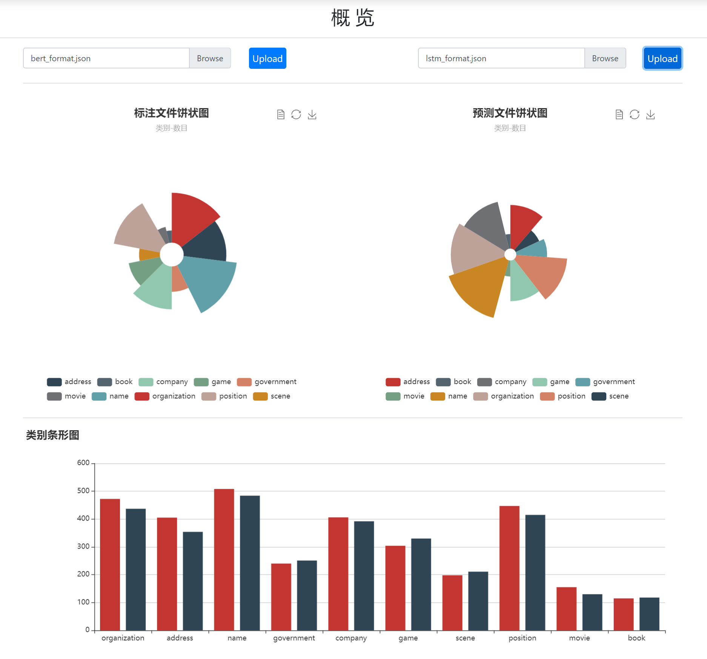
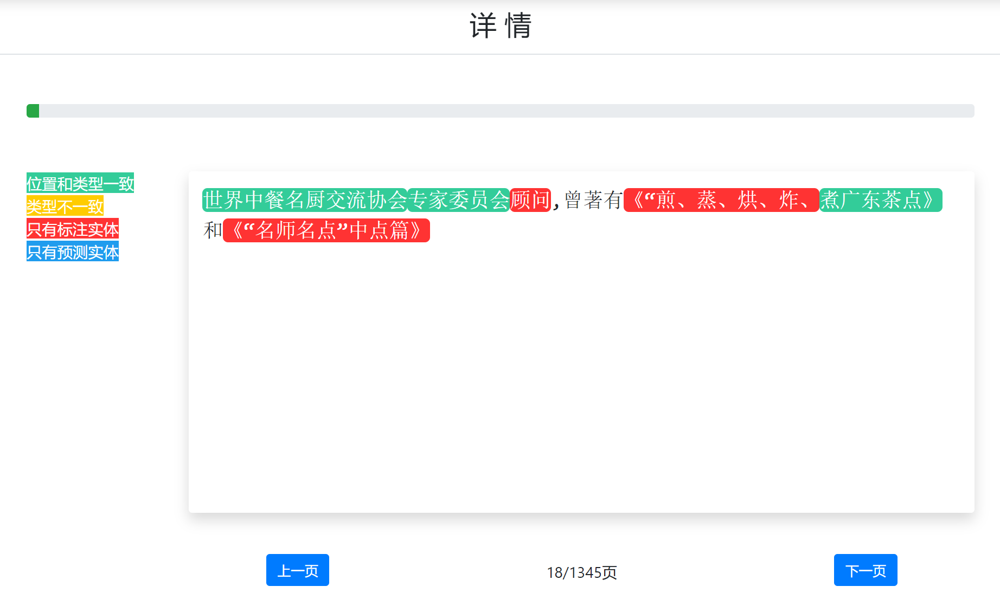

# 可视化工具

## catag

比较标注文件（gold file）和预测文件





### 环境

- python>=3.6
- django==3.0.7

### 运行

```
cd catag
python manage.py migrate
python manage.py createsuperuser
python manage.py runserver
```


### 格式

```
{"text": "温格的球队终于又踢了一场经典的比赛，2比1战胜曼联之后枪手仍然留在了夺冠集团之内，", "label": [[0, 2, "name"], [23, 25, "organization"]]}
{"text": ...}
...
```
